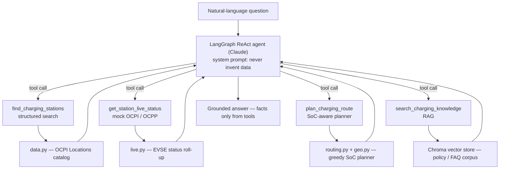

# Electra Charging Copilot

A grounded **LLM + RAG** conversational assistant for EV charging — find the right charger across
networks, check live availability, plan a multi-stop route, and answer policy questions, with every
fact sourced from a tool call, never invented by the model.

[](LICENSE)


[](https://electra-demos.vercel.app)

> **Engineering thesis:** an LLM should be the _interface_, never the _source of truth_. Every fact
> about a station, its live availability, a route, or a price comes from a **tool call or RAG retrieval
> over real data** — the model converses and explains, but it cannot invent charger data. That
> discipline is what makes LLM features shippable in a domain where a hallucinated "available 350 kW
> charger" strands a driver.

Built with **FastAPI · LangGraph · Chroma · Claude**.

## Demo

A dark web client (`ui.html`) calling the deterministic, keyless `/route` endpoint — a real
Paris → Bordeaux plan with grounded stops, charge times and costs. Recorded local run:


Walkthrough page: **https://electra-demos.vercel.app**

## Features

- **Grounded conversational agent** — a LangGraph ReAct agent (Claude) that decides which tools to
  call and answers only from their output; the system prompt forbids invented data.
- **SoC-aware route planner** — a deterministic, explainable greedy planner that minimizes stops while
  never dropping below a safety-buffer state-of-charge, accounting for battery capacity, consumption,
  station power with a charging-curve derate, tariffs, and detour cost.
- **Structured station search** — filter by city, power, connector, tariff and amenities over an
  OCPI-shaped catalog.
- **Live availability** — mock OCPI/OCPP EVSE status roll-up, swappable for a real feed.
- **RAG knowledge** — Chroma-backed retrieval over a roaming/policy/FAQ corpus, with sources.
- **Keyless core** — routing, search and live status are pure-Python and fully tested without any
  API key; only `/chat` needs a model provider.

## Architecture



The routing engine (`routing.py`) is deliberately explainable: a constrained-optimization core you can
interrogate on trade-offs, not a black box.

## Tech stack

| Layer       | Technologies                                              |
| ----------- | --------------------------------------------------------- |
| API         | FastAPI, Uvicorn, Pydantic v2, pydantic-settings          |
| Agent / LLM | LangGraph, LangChain Core, Claude (`langchain-anthropic`) |
| Retrieval   | Chroma vector store                                       |
| Testing     | pytest, httpx                                             |
| Packaging   | Docker (python:3.11-slim)                                 |

## Getting started

### Prerequisites

- Python 3.11+
- An `ANTHROPIC_API_KEY` (only for the `/chat` agent and the CLI demo — everything else is keyless)

### Install

```bash
pip install -r requirements.txt
cp .env.example .env          # add your ANTHROPIC_API_KEY for /chat
```

### Run the API

```bash
uvicorn app.main:app --reload --port 8080
# open http://localhost:8080/docs
```

```bash
# keyless endpoints — no API key needed
curl localhost:8080/stations
curl localhost:8080/stations/ELEC-PAR-01/status
curl -X POST localhost:8080/route -H 'content-type: application/json' \
     -d '{"origin":"Paris","destination":"Bordeaux","current_battery_pct":70,"car_model":"Peugeot e-208"}'

# grounded agent — needs ANTHROPIC_API_KEY
curl -X POST localhost:8080/chat -H 'content-type: application/json' \
     -d '{"question":"Cheapest fast charger in Lyon with a café, free right now?"}'
```

### Run the web UI

```bash
python -m scripts.demo_server     # serves the dark UI at http://localhost:8755/ui
```

### CLI demo reel

```bash
python -m scripts.demo
python -m scripts.demo "Can I reach Brussels from Paris at 50% in an Ioniq 5?"
```

## API reference

| Method | Endpoint                | API key | Description                       |
| ------ | ----------------------- | ------- | --------------------------------- |
| GET    | `/healthz`              | no      | Liveness check                    |
| GET    | `/stations`             | no      | List / filter the station catalog |
| GET    | `/stations/{id}/status` | no      | Live availability for a station   |
| POST   | `/route`                | no      | SoC-aware multi-stop route plan   |
| POST   | `/chat`                 | yes     | Grounded conversational agent     |

## Testing

```bash
pytest -m "not slow"   # core + API + tools, no network/key
pytest                 # + RAG retrieval (downloads a small embedding model once)
```

The pure-Python core (geo, routing, search, live) and the FastAPI endpoints are fully tested
**without any API key**. The RAG retriever is tested against a real Chroma store. **17 tests.**

## Project structure

```
app/
  main.py        FastAPI app + endpoints
  agent.py       LangGraph ReAct agent (lazy LLM import)
  tools.py       the four grounded tools
  routing.py     SoC-aware route planner
  geo.py         haversine + route geometry
  data.py        OCPI-shaped station catalog
  live.py        mock EVSE status roll-up
  knowledge.py   Chroma RAG retriever
  search.py      structured station search
  models.py      Pydantic domain models
  config.py      settings
scripts/
  demo.py        CLI demo reel
  demo_server.py serves the web UI on the live API
tests/           pytest suite (17 tests)
ui.html          dark web UI for the route planner
```

## Domain modelling

Field names and module boundaries mirror real EV-charging infrastructure, so a production backend is a
drop-in swap rather than a rewrite:

| This repo                        | Real-world equivalent                                   |
| -------------------------------- | ------------------------------------------------------- |
| `data.py` catalog                | OCPI **Locations** module                               |
| `live.py` status                 | real-time EVSE supervision (OCPP/EVSE)                  |
| `routing.py`                     | EV-optimized routing problem                            |
| RAG over policy docs             | help-centre / ops knowledge grounding                   |
| "tools = truth, LLM = interface" | shipping LLM features without hallucinated charger data |

## Design choices

- **Grounding by construction.** The system prompt forbids invented data and the tools are the only
  source of facts — "the LLM makes up a charger" is designed out, not patched.
- **Deterministic core, probabilistic shell.** Routing, search and live status are pure and
  unit-tested; only the conversational layer is non-deterministic, so correctness is verifiable
  without paying for or flaking on model calls.
- **Lazy LLM imports.** `agent.py` and `knowledge.py` import the heavy stack lazily, so the
  data/routing core runs anywhere and tests stay fast.
- **Operability first.** Structured endpoints are separate from `/chat`, so health, catalog and
  routing keep working even if the model provider is down (`/chat` degrades to a clean 503).

## Roadmap

- **Price-aware routing** — add a cost-vs-time Pareto objective to prefer cheaper sites over pricier
  roaming partners.
- Swap the mock status for a **live OCPI feed**; back telemetry with **TimescaleDB** hypertables.
- Replace in-process tools with **NATS** request/reply to real services.
- Add **streaming** responses and an **eval** harness (faithfulness / grounding checks).
- Persist the vector store and cite real help-centre docs in answers.

## License

MIT — see [LICENSE](LICENSE).

## Author

**Pyae Sone (Seon)** — [github.com/soneeee22000](https://github.com/soneeee22000)
