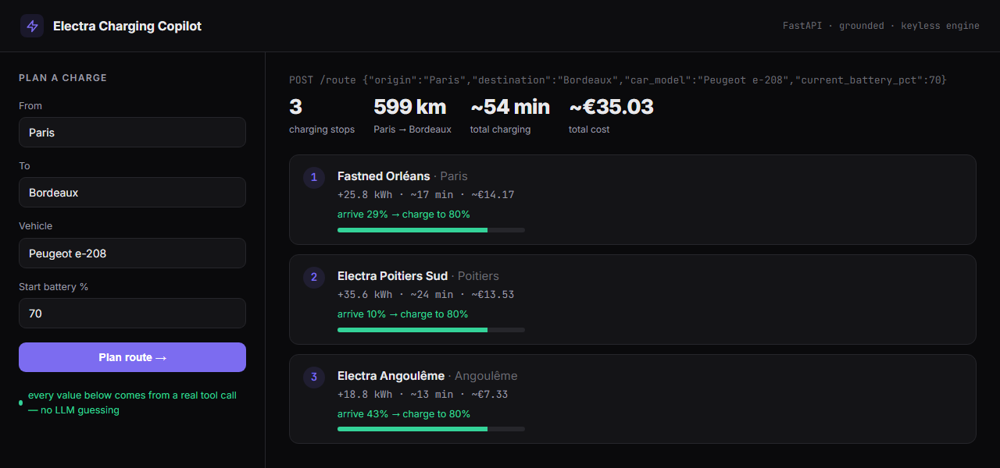
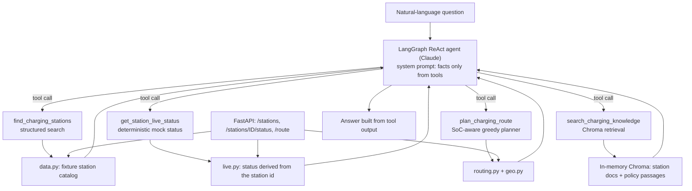

# Electra Charging Copilot

A grounded LLM + RAG assistant for EV charging: the model converses, and it is instructed to take every station, availability, route and price from a tool call.

[](https://github.com/soneeee22000/electra-charging-copilot/actions/workflows/ci.yml)
[](requirements.txt)
[](tests)
[](LICENSE)
[](https://github.com/soneeee22000/electra-charging-copilot/commits/main)



**[Walkthrough](https://electra-demos.vercel.app)** · [Results](#results) · [Why this exists](docs/WHY.md) · [Limitations](#limitations)

The walkthrough page shows recorded local runs (screenshots and captured output). It is not a hosted backend and it does not call a model. To use the app, run it locally; the route planner, search and status endpoints need no API key.

This is an independent portfolio project. It is not affiliated with or endorsed by any charging operator. The station catalog, tariffs, availability and policy text are invented fixtures, not any operator's real network or prices.

## Why this exists

A charging assistant that invents a station, a free charger or a price does real damage: the driver detours to a site that is full, closed or does not exist. A general-purpose chat model will produce plausible charger data if it is allowed to. The design here keeps the model as the interface and makes the data layer the only source of facts: search, availability and routing are deterministic Python the model calls as tools, and policy questions go through retrieval. The longer version is in [docs/WHY.md](docs/WHY.md).

## What it solves

| Layer       | Problem                                                              | How the project answers it                                                                                                             |
| ----------- | -------------------------------------------------------------------- | -------------------------------------------------------------------------------------------------------------------------------------- |
| Data        | Facts about stations must come from somewhere checkable.             | An in-memory station catalog (`app/data.py`) with field names borrowed from OCPI vocabulary: power, connectors, tariff, charge points. |
| Core logic  | Energy and range arithmetic is where a language model is least safe. | A deterministic route planner (`app/routing.py`) tracks state of charge and never plans to arrive below a 10% buffer (checked by a test over every city pair, car profile and start charge from 10% to 100% in 10-point steps). No LLM involved. |
| Retrieval   | "How does roaming / Plug & Charge / idle fees work" needs a source.  | Chroma retrieval over station documents and six policy passages (`app/knowledge.py`).                                                  |
| Agent       | The model has to pick the right data source for each question.       | A LangGraph ReAct agent with four tools; the system prompt forbids answering stations, prices, availability or routes without a tool.  |
| Operability | A model outage should not take down the whole service.               | Structured endpoints are separate from `/chat`, which returns a 503 when the agent is unavailable.                                     |

## Architecture



The keyless endpoints call the same core modules as the agent's tools, so the route the agent reports and the route `/route` returns are computed by the same function.

## Features

| Feature             | What it does                                                                                                                                                                                 | Where              |
| ------------------- | -------------------------------------------------------------------------------------------------------------------------------------------------------------------------------------------- | ------------------ |
| Grounded agent      | LangGraph `create_react_agent` bound to four tools and Claude (`claude-sonnet-4-6` by default, configurable). Answers are required to come from tool output by the prompt; this is not checked automatically. | `app/agent.py`     |
| Route planner       | Greedy: at each step, drive to the reachable CCS charger furthest along the corridor, charge to 80%, repeat until the destination is reachable above the buffer. Prices each stop.           | `app/routing.py`   |
| Station search      | Filters the catalog by city, minimum power, connector, amenity and operator, most powerful first.                                                                                            | `app/search.py`    |
| Availability (mock) | A deterministic status per station, derived from the sum of its id's character codes, so runs are reproducible.                                                                               | `app/live.py`      |
| Retrieval           | Chroma's default embedding function over 16 station documents and 6 policy passages, top 4 by default.                                                                                       | `app/knowledge.py` |
| Web client          | A single-page client for `/route`, served same-origin by `scripts/demo_server.py`.                                                                                                           | `ui.html`          |

## Results

The route planner is deterministic, so its output can be reproduced exactly. From `plan_route("Paris", "Bordeaux", 70, "Peugeot e-208")`, the same request the screenshot above sends to `POST /route`:

| #   | Stop                 | Arrive | Depart | Added    | Charging | Cost       |
| --- | -------------------- | ------ | ------ | -------- | -------- | ---------- |
| 1   | Fastned Orléans      | 29%    | 80%    | 25.8 kWh | ~17 min  | ~14.17 EUR |
| 2   | Electra Poitiers Sud | 10%    | 80%    | 35.6 kWh | ~24 min  | ~13.53 EUR |
| 3   | Electra Angoulême    | 43%    | 80%    | 18.8 kWh | ~13 min  | ~7.33 EUR  |

Total: 599.2 km, 3 stops, ~54 min of charging, ~35.03 EUR. The 599.2 km is the direct Paris to Bordeaux estimate; it does not add the distance of the legs via the stops. Paris to Dijon at 90% in a Tesla Model 3 (315.2 km) needs no stop.

**Read this carefully.** These are outputs of a simple model over invented fixtures, not measured trips. Distances are great-circle distance times 1.2, not road routing, and charge times assume a flat 60% of peak power capped at 150 kW for every car. Stop 3 exists because the planner always charges to 80%: with the target set to 100%, the same trip plans two stops. That is a known limitation, listed below.

**Tests.** 30 pytest tests, all passing locally on Python 3.11.15 and 3.12.13 (2026-09-24). A CI workflow for 3.11 and 3.12 is included but has not yet run on GitHub. None needs an API key.

| File                          | Tests | Covers                                                                                          |
| ----------------------------- | ----- | ----------------------------------------------------------------------------------------------- |
| `tests/test_core.py`          | 9     | Haversine, route progress, search filters, deterministic status, planner feasibility and stops  |
| `tests/test_api.py`           | 4     | `/healthz`, `/stations`, `/stations/{id}/status` (200 and 404), `/route` (feasible and unknown) |
| `tests/test_tools_and_rag.py` | 4     | Three tool wrappers, plus one retrieval test against a real in-memory Chroma store (`slow`)     |
| `tests/test_planner_safety.py` | 5    | Every feasible plan in a grid arrives above the buffer (re-driven leg by leg); out-of-range start charge; unknown car model |
| `tests/test_input_limits.py`  | 5     | `/route` and `/chat` reject out-of-range or oversized input; `/chat` errors do not echo internal text |
| `tests/test_tool_inputs.py`   | 3     | Connector matching is case-insensitive, unknown connectors are reported, default car profile is disclosed |

The agent itself (`/chat`) has no automated test: nothing in the suite calls a model.

## Getting started

Requires Python 3.11 or newer. An `ANTHROPIC_API_KEY` is needed only for `/chat` and the CLI demo.

```bash
git clone https://github.com/soneeee22000/electra-charging-copilot.git
cd electra-charging-copilot
python -m venv .venv && source .venv/bin/activate   # Windows: .venv\Scripts\activate
pip install -r requirements.txt
cp .env.example .env                                  # add ANTHROPIC_API_KEY for /chat
```

Run the tests:

```bash
pytest -m "not slow"   # 29 tests: core, API, tools; no network
pytest                 # all 30; the RAG test downloads Chroma's default embedding model once
```

Run the API and call the keyless endpoints:

```bash
uvicorn app.main:app --reload --port 8080            # docs at http://localhost:8080/docs

curl localhost:8080/stations
curl localhost:8080/stations/ELEC-PAR-01/status
curl -X POST localhost:8080/route -H 'content-type: application/json' \
     -d '{"origin":"Paris","destination":"Bordeaux","current_battery_pct":70,"car_model":"Peugeot e-208"}'
```

Ask the agent (needs `ANTHROPIC_API_KEY`):

```bash
curl -X POST localhost:8080/chat -H 'content-type: application/json' \
     -d '{"question":"Cheapest fast charger in Lyon with a café, free right now?"}'
python -m scripts.demo                 # scripted questions, each forcing a tool call
```

Web client: `python -m scripts.demo_server`, then open http://localhost:8755/ui.

| Method | Endpoint                | API key | Description                       |
| ------ | ----------------------- | ------- | --------------------------------- |
| GET    | `/healthz`              | no      | Liveness check                    |
| GET    | `/stations`             | no      | The station catalog               |
| GET    | `/stations/{id}/status` | no      | Mock availability for one station |
| POST   | `/route`                | no      | SoC-aware multi-stop route plan   |
| POST   | `/chat`                 | yes     | The grounded agent                |

## Project structure

```
app/
  main.py        FastAPI app and endpoints
  agent.py       LangGraph ReAct agent and system prompt (LLM stack imported lazily)
  tools.py       the four tools the agent can call
  routing.py     SoC-aware greedy route planner
  geo.py         haversine, route progress, detour
  data.py        fixture station catalog, cities, EV models
  live.py        deterministic mock availability
  knowledge.py   Chroma retrieval over station and policy documents
  search.py      structured station search
  models.py      Pydantic domain models
  config.py      settings from environment / .env
scripts/
  demo.py        CLI demo (needs an API key)
  demo_server.py serves ui.html next to the API
tests/           30 pytest tests
docs/            demo screenshot, WHY.md
ui.html          web client for /route
```

## Limitations

- **Fixture data only.** 16 stations, 8 routable cities and 4 EV models plus a default profile, all hand-written. Tariffs and the policy passages are illustrative, not sourced. Two fixtures carry a wrong `city` field (the Orléans and Mâcon stations are filed under Paris and Lyon), which affects city search.
- **Availability is a mock.** It is computed from the station id's character codes, not a feed. The same station always shows the same status.
- **Grounding is enforced by the prompt, not verified.** There is no evaluation of `/chat`: no faithfulness or tool-use checks, no recorded model runs. The claim that answers come only from tools is a design intent that has not been measured.
- **Planner simplifications.** Straight-line distance times 1.2 instead of road routing; one assumed charging power for every car; a fixed 80% charge target, which can add stops (see Results); greedy choice by distance along the route, not by cost or total time; detour is only a 40 km filter, not a cost.
- **Retrieval is small and lightly tested.** 22 documents in an in-memory store rebuilt per process; the single retrieval test checks that a roaming-related passage comes back, not ranking quality.
- **No rate limiting or authentication.** Request sizes are capped (`/chat` questions at 1000 characters, `/route` start charge 0-100%), but nothing limits request rate. With `ANTHROPIC_API_KEY` set, a public `/chat` would let anyone spend on that key.
- **Dependencies are lower-bounded, not locked** (`requirements.txt` uses `>=`), so a future release of LangGraph or Chroma can change behaviour.
- **Not deployed.** Only the recorded walkthrough page is hosted.

## Roadmap

- An evaluation harness for `/chat`: recorded model runs, checks that every station id, price and time in an answer appears in that turn's tool output.
- A variable charge target, and a cost-versus-time objective, in the planner.
- A real availability feed behind the same `live_status` interface.
- Locked dependencies and a keyless deploy of the API and web client.

## License

MIT, see [LICENSE](LICENSE).

## Author

**Pyae Sone (Seon)**, [github.com/soneeee22000](https://github.com/soneeee22000)
